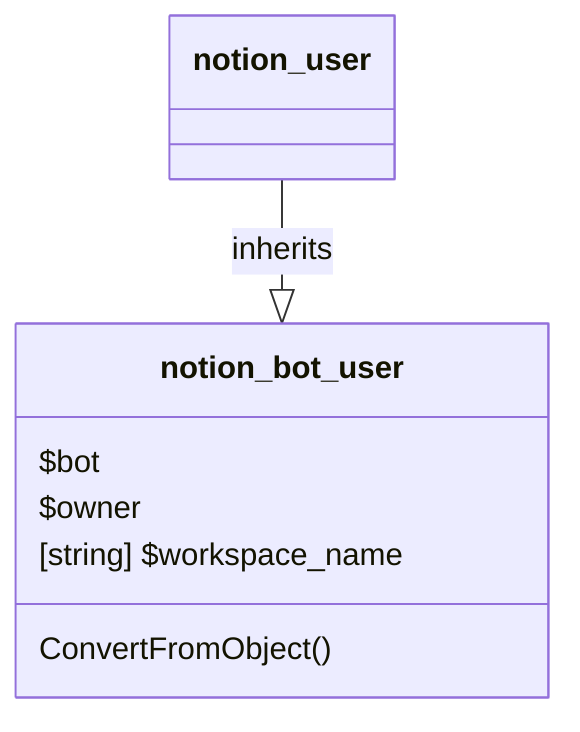

# User: Bot

[API Reference](https://developers.notion.com/reference/user#bots)

```mermaid
classDiagram
    class notion_bot_user {
        $bot
        $owner
        [string] $workspace_name
        ConvertFromObject()
    }
    `notion_user` --|> `notion_bot_user`:inherits
```
