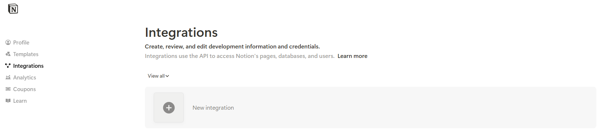
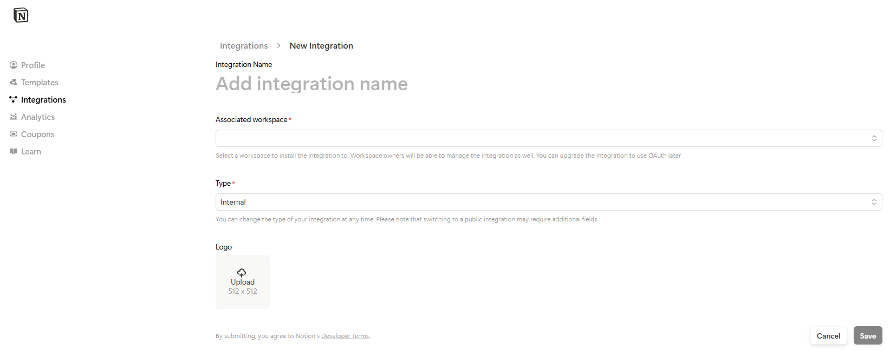
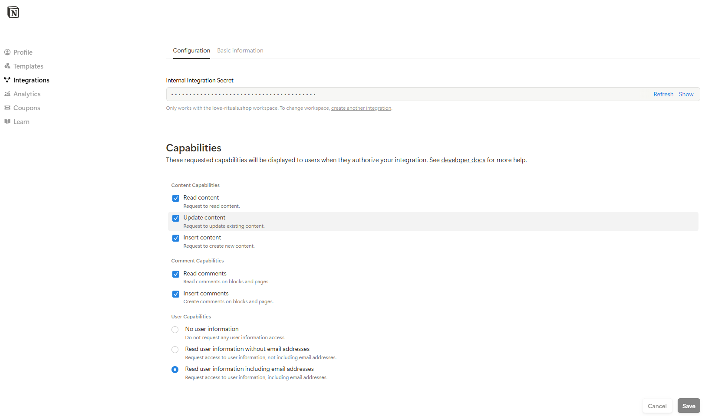
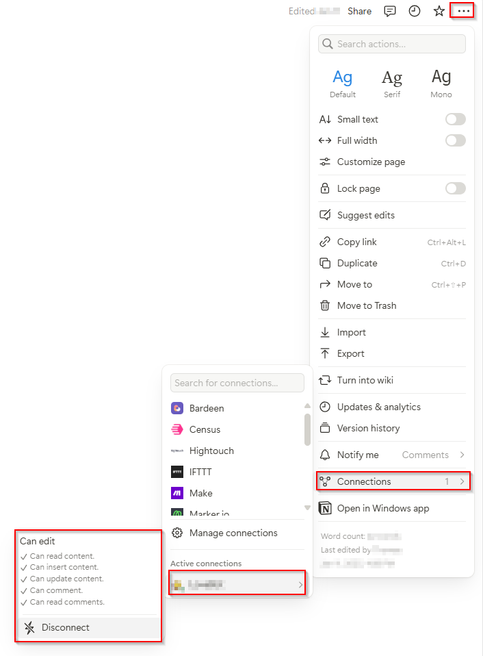

# Integration

1. Left pane: Settings > Connections > Develop or manage integrations

    

2. New integration

    

   1. Add integration name
   2. Associated workspace (select your workspace) 
   3. Select integration type: Internal
   4. Optional: Upload your logo

3. Configration

    

   1. Internal Integration Secret

       Click on "Show" and copy this secret to use it within the Notion PowerShell module

       (That's your Bearer Token / API Key / Integration Token)

   3. Capabilities
      1. Content Capabilitis (Read, Update, Insert)
      2. Comment Capabilitis (Read, Insert)
      3. User Capabilities (No, Read, Read user info incl. email addresses)

4. Save

5. Check if the integration cann access you page/database/etc
   1. Press the upper right menue "..."
   2. Connections
   3. Active connections

